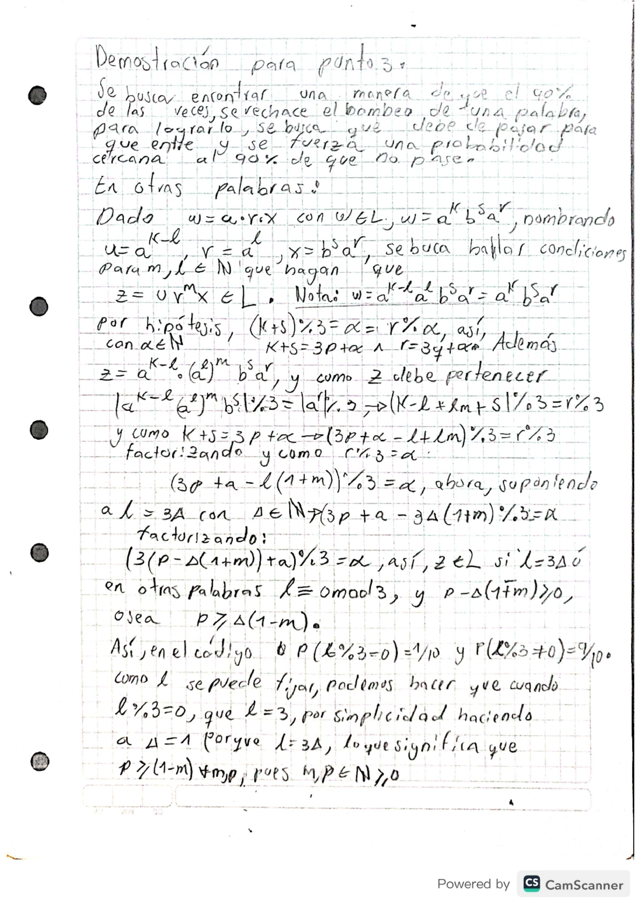

# Lab1 - White

Simulación interactiva del lema de bombeo para lenguajes formales a partir de una demostración formal adjuntada

## Hay tres modos de simulación:

Modo manual (interactivo):
El usuario ingresa una palabra que cumple con el lenguaje. Luego elige un valor de m (longitud mínima del lema de bombeo).
El programa genera todas las posibles particiones uvw con |uv| ≤ m y |v| ≥ 1, y evalúa si las palabras bombeadas siguen en el lenguaje.
El resultado tiende a un empate (≈ 50/50), pero depende de la cadena original y el valor de m.

Simulación justa (no sesgada):
Se ejecutan n simulaciones automáticas con distintas particiones aleatorias, manteniendo imparcialidad.
A medida que n crece, la proporción de aciertos se estabiliza alrededor del 50%, sin importar el valor de m.

Simulación sesgada (buscando 90/10):
Se intenta sesgar el proceso para que el 90% de las palabras bombeadas no pertenezcan al lenguaje.
Esto se logra asignando aleatoriamente a ℓ (la longitud total bombeada) valores donde solo 1 de cada 10 es múltiplo de 3.
La estrategia es efectiva salvo para valores de m de la forma m = 3y + 1, donde el rendimiento se degrada y aumentan los aciertos del usuario.
Aunque aún no se determinó por qué ocurre esto, se observó que para 2/3 de los valores posibles (m ≡ 0 o 2 mod 3), el sesgo hacia el 90% se mantiene.

## Objetivos

- Simular el lema de bombeo en distintos escenarios.
- Evaluar estrategias para que el autómata gane con mayor probabilidad.
- Justificar matemáticamente cuándo y por qué se obtiene una alta tasa de éxito.

---

## Demostración del punto 3

A continuación se muestra la demostración matemática usada para justificar los resultados del programa cuando `ℓ ≡ 0 (mod 3)`:

> Esta demostración busca explicar por qué se puede alcanzar una tasa de éxito ≥ 90% cuando `ℓ ≡ 0 (mod 3)`.

---

## Instrucciones de uso

1. Cloná el repositorio.
2. Ejecutá el archivo `codigo.py`.
3. Elegí una opción del menú para interactuar con el sistema.

---

## Notas

- Este proyecto fue hecho en Codespaces.
- Se puede adaptar para que el autómata gane con distintas estrategias.

## FUENTES:
Se utiizó la IA para hacer el ambiente más amigable, con el suo de "EMOGIS" y de elementos decorativos en el menú como =,-,_,l. y tambien en el read me, para que se vieran más profecsionales los simbolor de la explciación del código. 

